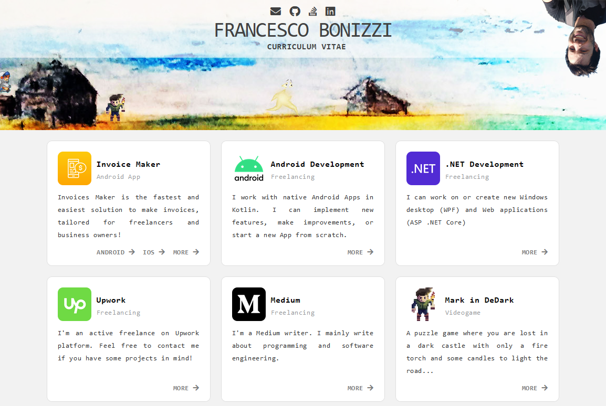

# fbonizziDotIt

This is [my personal website code](https://www.fbonizzi.it), written just in `HTML`, `JS`, `CSS`.
 
Why so simple?
Because I don't see any reasons to add dinamicity to a so simple portfolio website!

It shows:
- My portfolio 
- My [curriculum vitae](https://github.com/FrancescoBonizzi/CurriculumVitaeExporter).
- My contact links

